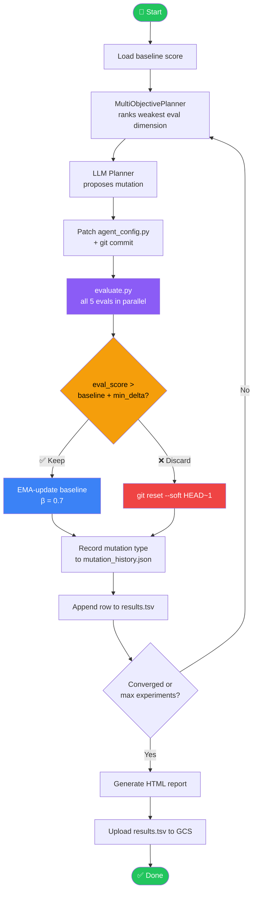
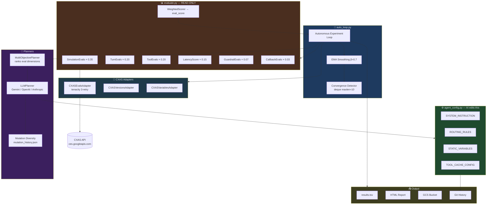
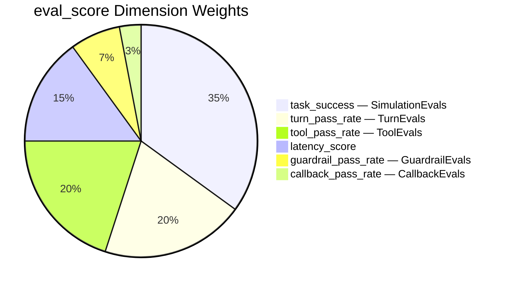

# auto-cxas-scrapi

> Autonomous optimization loop for Google Cloud CX Agent Studio (CXAS),
> powered by [cxas-scrapi](https://github.com/GoogleCloudPlatform/cxas-scrapi)
> and inspired by [autoresearch](https://github.com/karpathy/autoresearch) loop patterns.

[](https://python.org)
[](LICENSE)
[](https://github.com/Yash-Kavaiya/auto-cxas-scrapi/actions/workflows/ci.yml)

📚 **[Full Documentation](docs/index.md)** &nbsp;·&nbsp; [Architecture](docs/architecture.md) &nbsp;·&nbsp; [Configuration](docs/configuration.md) &nbsp;·&nbsp; [Deployment](docs/deployment.md)

---

## What it does

`auto-cxas-scrapi` runs an autonomous **propose → commit → eval → keep/discard** loop
that continuously improves your CXAS agent configuration without human intervention
between experiments. It targets the weakest eval dimension each iteration and stops
automatically when the score window converges.



---

## System Architecture



---

## Score formula (v2)

```
eval_score = task_success        × 0.35   (SimulationEvals — goal completion)
           + turn_pass_rate      × 0.20   (TurnEvals — per-turn quality)
           + tool_pass_rate      × 0.20   (ToolEvals — tool call accuracy)
           + latency_score       × 0.15   (1 − p95_ms/5000, capped 0–1)
           + guardrail_pass_rate × 0.07   (GuardrailEvals — safety blocking)
           + callback_pass_rate  × 0.03   (CallbackEvals — webhook validation)
```



All six weights sum to **1.0** and are consistent across `evaluate.py`,
`WeightedScorer`, and `MultiObjectivePlanner`.

---

## Quick start

```bash
# 1. Install
pip install -e .

# 2. Configure
cp .env.example .env
# Edit .env: set GOOGLE_CLOUD_PROJECT, AUTO_CXAS_APP_NAME, AUTO_CXAS_LLM_PROVIDER

# 3. Sanity check (no live CXAS calls)
python evaluate.py --dry-run

# 4. Start the loop
python auto_loop.py --ema --dry-run          # dry-run first
python auto_loop.py --ema --max-experiments 50   # live
```

### Key CLI flags

| Flag | Description |
|---|---|
| `--ema` | EMA-smooth the baseline (β=0.7) to reduce eval noise |
| `--max-experiments N` | Hard cap on loop iterations |
| `--dry-run` | Skip live CXAS API calls; use heuristic scorer |
| `--tag LABEL` | Label every TSV row for this run |
| `--sleep S` | Seconds between experiments (default 2) |

---

## Configuration

All settings are read from `.env` (see `.env.example`):

| Variable | Default | Description |
|---|---|---|
| `GOOGLE_CLOUD_PROJECT` | _(required)_ | GCP project ID |
| `AUTO_CXAS_APP_NAME` | _(required)_ | CXAS app display name |
| `AUTO_CXAS_LLM_PROVIDER` | `gemini` | `gemini` \| `openai` \| `anthropic` |
| `AUTO_CXAS_APPROVAL_MODE` | `manual` | `auto` to keep improvements without prompt |
| `AUTO_CXAS_MIN_SCORE_DELTA` | `0.01` | Minimum score gain to keep an experiment |
| `AUTO_CXAS_CONVERGENCE_WINDOW` | `10` | Sliding window size for convergence check |
| `AUTO_CXAS_CONVERGENCE_THRESHOLD` | `0.002` | Stop when max−min < threshold over window |
| `AUTO_CXAS_MAX_PARALLEL_EVALS` | `3` | Eval types to run in parallel per iteration |
| `AUTO_CXAS_EVAL_TIMEOUT_SECONDS` | `180` | Per-evaluation timeout |
| `AUTO_CXAS_GENERATE_HTML_REPORT` | `false` | Write HTML report at loop end |
| `AUTO_CXAS_REPORT_DIR` | `.auto-cxas/reports` | HTML report output directory |
| `AUTO_CXAS_GCS_RESULTS_BUCKET` | _(optional)_ | Upload `results.tsv` to this GCS bucket |
| `AUTO_CXAS_DIVERSITY_WINDOW` | `5` | Last N mutations tracked for diversity enforcement |
| `AUTO_CXAS_CALLBACK_SERVER_URL` | _(optional)_ | Webhook URL for live CallbackEvals |

→ [Full configuration reference](docs/configuration.md)

---

## Mutable experiment dimensions

The LLM planner mutates any of these in `agent_config.py` each iteration:

| Variable | Eval impact | Mutation type |
|---|---|---|
| `SYSTEM_INSTRUCTION` | task_success, turn_pass_rate | `prompt_patch` |
| `STATIC_VARIABLES` (`{{var}}`) | task_success (large policy blocks, zero history cost) | `variable_tune` |
| `VARIABLES` (`{var}` session state) | task_success | `variable_tune` |
| `ROUTING_RULES` thresholds | task_success, tool_pass_rate | `threshold_tune` |
| `TOOL_DESCRIPTIONS` | tool_pass_rate | `config_update` |
| `GUARDRAIL_PARAMS` | guardrail_pass_rate | `config_update` |
| `RESPONSE_TEMPLATES` | task_success, turn_pass_rate | `template_change` |
| `CALLBACKS.before_model.deterministic_intents` | latency_score (LLM bypass) | `callback_tune` |
| `CALLBACKS.before_tool.cacheable_tools` | latency_score (tool cache) | `cache_tune` |
| `TOOL_CACHE_CONFIG[tool].ttl_seconds` | latency_score | `cache_tune` |
| `CALLBACK_CONFIG[tool].timeout_ms` | callback_pass_rate | `callback_tune` |

---

## Golden test suite

**54 tests** across 6 categories in `golden_tests.yaml`:

| Category | IDs | Count |
|---|---|---|
| Happy path | gt_001–gt_016 | 16 |
| Multi-turn flows | gt_017–gt_024 | 8 |
| Ambiguous intents | gt_025–gt_032 | 8 |
| Edge cases | gt_033–gt_039 | 7 |
| Guardrail triggers | gt_040–gt_044 | 5 |
| Persona variants | gt_045–gt_054 | 10 |

Each test supports: `session_variables`, `persona`, `multi_turn_context`,
`should_be_blocked`. Additional YAML files are auto-loaded from `tests/golden/`.

---

## Adapters

| Adapter | Purpose |
|---|---|
| `CXASEvalsAdapter` | Runs all 5 eval types via `cxas-scrapi`; wraps every call with 3-attempt tenacity retry |
| `CXASCallbackAdapter` | Registers all 5 CXAS lifecycle hooks (before/after model, before/after tool, after agent) |
| `CXASVariablesAdapter` | Syncs `STATIC_VARIABLES` (`{{var}}`) and `VARIABLES` (`{var}`) to the live CXAS app |
| `CXASVersionsAdapter` | Manages CXAS Versions + Deployments via `ces.googleapis.com/v1alpha1` REST API |
| `ScrapiAdapter` | Low-level `cxas-scrapi` client wrapper |

→ [Adapter reference](docs/adapters.md)

---

## Production deployment

### Docker

```bash
docker build -t auto-cxas-scrapi .
docker run --env-file .env auto-cxas-scrapi \
  python auto_loop.py --ema --max-experiments 200
```

### Cloud Run Job

```bash
# Build and push
docker build -t gcr.io/PROJECT_ID/auto-cxas-scrapi .
docker push gcr.io/PROJECT_ID/auto-cxas-scrapi

# Deploy job (edit PROJECT_ID in cloudrun.yaml first)
gcloud run jobs replace cloudrun.yaml --region=us-central1

# Execute
gcloud run jobs execute auto-cxas-scrapi --region=us-central1
```

The Cloud Run Job runs up to 200 experiments, generates an HTML report, and
uploads `results.tsv` to GCS on completion.

→ [Full deployment guide](docs/deployment.md)

---

## Project structure

```
auto-cxas-scrapi/
├── evaluate.py                     # Eval harness — READ-ONLY for AI agent
├── agent_config.py                 # Agent config — AI edits this
├── auto_loop.py                    # Autonomous experiment loop
├── golden_tests.yaml               # 54 built-in golden tests
├── results.tsv                     # Run journal (append-only)
├── program.md                      # Experiment strategy guide
├── AGENTS.md                       # Claude Code / Codex context
├── Dockerfile                      # Production container
├── cloudrun.yaml                   # Cloud Run Job definition
├── .github/workflows/ci.yml        # CI: lint, type-check, score regression
├── .env.example                    # All supported env vars
├── docs/
│   ├── index.md                    # Documentation overview
│   ├── architecture.md             # Component deep-dive
│   ├── configuration.md            # Full env-var reference
│   ├── eval-types.md               # All 5 eval types explained
│   ├── deployment.md               # Local, Docker, Cloud Run guides
│   ├── adapters.md                 # Adapter API reference
│   └── development.md              # Contributing & local dev
└── src/auto_cxas_scrapi/
    ├── adapters/                   # CXAS API adapters
    ├── planners/                   # LLM + multi-objective planners
    ├── reporting/                  # HTML report generator
    ├── scorers/                    # 6-dimensional WeightedScorer
    ├── config/                     # Pydantic settings
    └── services/                   # Orchestrator
```

---

## AI agent support

| Tool | Context file |
|---|---|
| Claude Code | `AGENTS.md` |
| Gemini CLI | `GEMINI.md` |
| GitHub Copilot | `.github/copilot-instructions.md` |
| OpenAI Codex | `AGENTS.md` |

---

## Safety

- `evaluate.py` is **READ-ONLY** — the AI agent must never modify it
- Failed experiments use `git reset --soft HEAD~1` + `git checkout -- agent_config.py` (never `--hard`)
- EMA smoothing (`--ema`) prevents a noisy eval from permanently lowering the baseline
- Convergence detection stops the loop automatically to prevent wasteful over-iteration
- Mutation diversity enforcement prevents the LLM from repeating the same change type

---

## License

Apache 2.0
