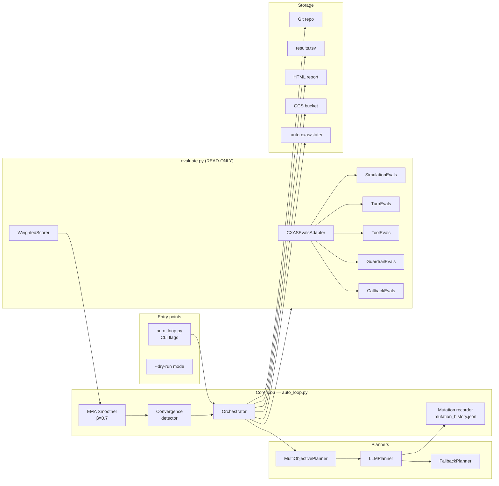
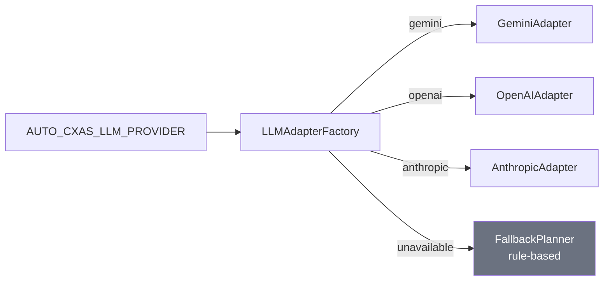

# Architecture

## Component overview



---

## Module map

| Module | Path | Responsibility |
|---|---|---|
| `auto_loop.py` | root | CLI entry point, loop orchestration, git operations |
| `evaluate.py` | root | Fixed eval harness — never modified |
| `agent_config.py` | root | Only file mutated during experiments |
| `WeightedScorer` | `scorers/weighted.py` | Computes 6-dim weighted eval_score |
| `LLMPlanner` | `planners/llm_planner.py` | Calls LLM to propose mutations; enforces diversity |
| `MultiObjectivePlanner` | `planners/multi_objective_planner.py` | Ranks eval dimensions by weakness |
| `CXASEvalsAdapter` | `adapters/cxas_evals.py` | Bridges evaluate.py → cxas-scrapi eval clients |
| `CXASVersionsAdapter` | `adapters/cxas_versions.py` | Versions + Deployments REST API |
| `CXASVariablesAdapter` | `adapters/cxas_variables.py` | Syncs static/session variables to live app |
| `CXASCallbackAdapter` | `adapters/cxas_callbacks.py` | Registers lifecycle hooks |
| `HtmlReport` | `reporting/html_report.py` | Self-contained dark-theme HTML with SVG chart |
| `Settings` | `config/settings.py` | Pydantic BaseSettings — all env vars |

---

## Data flow

```
agent_config.py
      │
      │ LLMPlanner patches + git commits
      ▼
  git history ──────────────────────────────────┐
      │                                          │
      │ evaluate.py reads agent_config.py        │ git reset --soft (on discard)
      ▼                                          │
 CXASEvalsAdapter                                │
  ├── SimulationEvals.run_simulations()          │
  ├── TurnEvals.run_turn_tests()                 │
  ├── ToolEvals.run_tool_tests()                 │
  ├── GuardrailEvals.run_guardrail_tests()       │
  └── CallbackEvals.test_all_callbacks()         │
      │                                          │
      ▼                                          │
 WeightedScorer.score()  ──► eval_score ─► KEEP ─┘
                                          DISCARD─┘
      │
      ▼
 EMA smoother ──► convergence deque ──► stop if converged
      │
      ▼
 results.tsv (append) ──► HTML report ──► GCS upload
```

---

## Convergence detection

The loop maintains a sliding window of the last N `eval_score` values using
`collections.deque(maxlen=convergence_window)`. After each experiment the
score is appended. When the window is full and
`max(window) - min(window) < convergence_threshold`, the loop stops.

```python
# Conceptual implementation
window = deque(maxlen=10)           # AUTO_CXAS_CONVERGENCE_WINDOW

window.append(eval_score)
if len(window) == window.maxlen:
    if max(window) - min(window) < 0.002:   # AUTO_CXAS_CONVERGENCE_THRESHOLD
        break  # converged
```

Default settings detect convergence after 10 consecutive experiments with
score variation below 0.002 (0.2 percentage points).

---

## Mutation diversity enforcement

To prevent the LLM from repeatedly applying the same mutation type (e.g.
always patching `SYSTEM_INSTRUCTION`), the planner tracks recent mutation
types in `.auto-cxas/state/mutation_history.json`.

```json
[
  {"type": "prompt_patch",   "path": "SYSTEM_INSTRUCTION", "ts": "2026-05-08T10:00:00Z"},
  {"type": "cache_tune",     "path": "TOOL_CACHE_CONFIG",  "ts": "2026-05-08T10:05:00Z"},
  {"type": "prompt_patch",   "path": "SYSTEM_INSTRUCTION", "ts": "2026-05-08T10:10:00Z"}
]
```

Before calling the LLM, `_build_diversity_note()` computes a frequency table
of recent types and injects a guidance block into the user prompt:

```
Mutation diversity guidance:
  Recent types (last 5): prompt_patch ×2, cache_tune ×1
  Untried types: threshold_tune, template_change, callback_tune, variable_tune
  Prefer one of the untried types for this proposal.
```

All 7 mutation types:

| Type | Target variable | Eval impact |
|---|---|---|
| `prompt_patch` | SYSTEM_INSTRUCTION | task_success, turn_pass_rate |
| `config_update` | TOOL_DESCRIPTIONS, GUARDRAIL_PARAMS | tool/guardrail |
| `threshold_tune` | ROUTING_RULES thresholds | task_success, tool_pass_rate |
| `template_change` | RESPONSE_TEMPLATES | task_success, turn_pass_rate |
| `callback_tune` | CALLBACKS, CALLBACK_CONFIG | latency_score, callback_pass_rate |
| `cache_tune` | TOOL_CACHE_CONFIG, cacheable_tools | latency_score |
| `variable_tune` | STATIC_VARIABLES, VARIABLES | task_success |

---

## EMA baseline smoothing

With `--ema`, the baseline is updated using Exponential Moving Average
rather than a hard replace, reducing the impact of individual noisy evals:

```
new_baseline = β × current_baseline + (1 − β) × new_score
             = 0.7 × baseline        + 0.3 × eval_score
```

This prevents a single abnormally good result from setting an unreachably
high baseline that causes all subsequent experiments to be discarded.

---

## LLM provider selection



If the selected LLM is unavailable (missing API key, network error), the
`FallbackPlanner` picks the next untried mutation type for the weakest eval
dimension without making any LLM calls.
