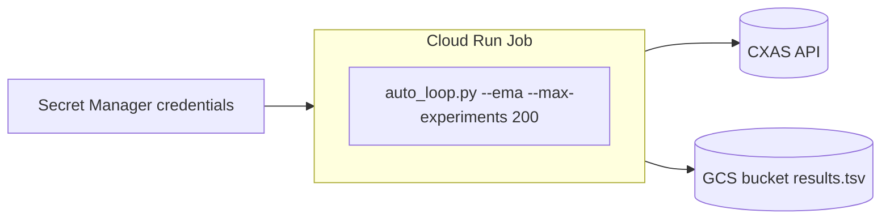

# Deployment

## Local development

```bash
git clone https://github.com/yash-kavaiya/auto-cxas-scrapi
cd auto-cxas-scrapi
python -m venv .venv && source .venv/bin/activate
pip install -e .

gcloud auth application-default login
gcloud config set project YOUR_PROJECT_ID

cp .env.example .env
python evaluate.py --dry-run
```

### Running the loop

```bash
# Dry-run (no live CXAS API calls)
python auto_loop.py --ema --dry-run --max-experiments 20

# Live, manual approval
python auto_loop.py --ema --max-experiments 50

# Fully autonomous
AUTO_CXAS_APPROVAL_MODE=auto python auto_loop.py --ema --max-experiments 200
```

---

## Docker

The `Dockerfile` uses a two-stage build: installs deps in a builder stage,
then copies only the wheel into a minimal `python:3.11-slim` runtime image
running as a non-root `appuser`.

```bash
# Build
docker build -t auto-cxas-scrapi .

# Run
docker run --rm \
  --env-file .env \
  -v $(pwd)/results.tsv:/app/results.tsv \
  auto-cxas-scrapi \
  python auto_loop.py --ema --max-experiments 50
```

---

## Cloud Run Job



### Step-by-step

**1. Create secrets**

```bash
echo -n "projects/PROJECT_ID/locations/us/apps/APP_NAME" | \
  gcloud secrets create auto-cxas-app-name --data-file=-

echo -n "my-gcs-bucket" | \
  gcloud secrets create auto-cxas-gcs-bucket --data-file=-
```

**2. Build and push**

```bash
docker build -t gcr.io/PROJECT_ID/auto-cxas-scrapi .
docker push gcr.io/PROJECT_ID/auto-cxas-scrapi
```

**3. Edit `cloudrun.yaml`** — replace all `PROJECT_ID` placeholders:

```bash
sed -i 's/PROJECT_ID/my-actual-project/g' cloudrun.yaml
```

**4. Deploy**

```bash
gcloud run jobs replace cloudrun.yaml --region=us-central1
gcloud run jobs execute auto-cxas-scrapi --region=us-central1
```

**5. Schedule (optional)**

```bash
gcloud scheduler jobs create http auto-cxas-nightly \
  --schedule="0 2 * * *" \
  --uri="https://us-central1-run.googleapis.com/apis/run.googleapis.com/v1/namespaces/PROJECT_ID/jobs/auto-cxas-scrapi:run" \
  --oauth-service-account-email=auto-cxas-scrapi@PROJECT_ID.iam.gserviceaccount.com
```

### IAM requirements

| Role | Purpose |
|---|---|
| `roles/dialogflow.admin` | CXAS API read/write |
| `roles/storage.objectCreator` | Upload results to GCS |
| `roles/secretmanager.secretAccessor` | Read secrets |

```bash
SA=auto-cxas-scrapi@PROJECT_ID.iam.gserviceaccount.com
gcloud projects add-iam-policy-binding PROJECT_ID \
  --member="serviceAccount:$SA" --role="roles/dialogflow.admin"
gcloud projects add-iam-policy-binding PROJECT_ID \
  --member="serviceAccount:$SA" --role="roles/storage.objectCreator"
```

---

## CI/CD

| Job | Checks |
|---|---|
| `lint-and-test` | ruff, pyright, weight-sum assertion, 54-test count, evaluate.py --dry-run, pytest |
| `score-regression` | eval_score >= 0.50 gate (dry-run) |
