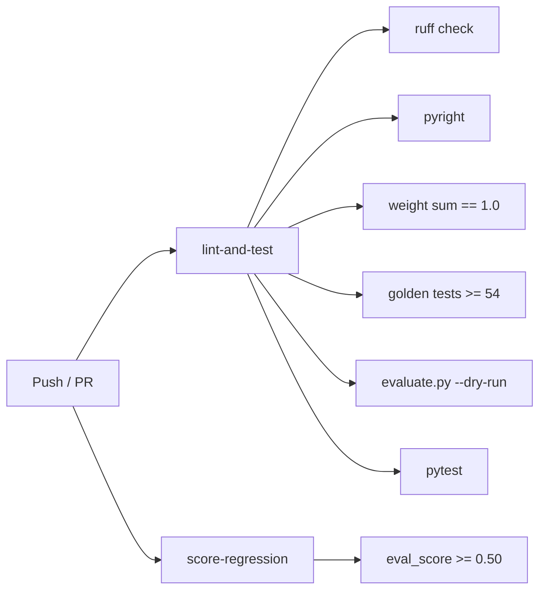

# Development

## Local setup

```bash
git clone https://github.com/yash-kavaiya/auto-cxas-scrapi
cd auto-cxas-scrapi
python -m venv .venv && source .venv/bin/activate
pip install -e ".[gemini,dev]"
```

Optional LLM extras: `pip install -e ".[openai]"` or `pip install -e ".[anthropic]"`

---

## Running tests

```bash
pytest tests/ -v          # all tests
pytest tests/ -n auto     # parallel
pytest tests/test_scorer.py -v   # single file
```

Tests use `unittest.mock` — no live CXAS credentials needed.

---

## Linting and type checking

```bash
ruff check .    # lint
ruff format .   # format
pyright src/    # types
```

---

## CI pipeline



---

## Adding a new mutation type

1. Add the type string to `_ALL_MUTATION_TYPES` in `planners/llm_planner.py`
2. Update the system prompt with a description of when to use it
3. Map it to eval dimensions in `multi_objective_planner.py`:
   ```python
   MUTATION_TYPE_IMPACT = {
       ...
       "your_new_type": ["task_success", "turn_pass_rate"],
   }
   ```
4. Add at least one golden test to `golden_tests.yaml` (CI gate: >= 54)
5. Add a unit test to `tests/test_llm_planner.py`

---

## Adding a new LLM backend

1. Create `adapters/llm/your_provider.py` implementing `BaseLLMAdapter`:
   ```python
   class YourProviderAdapter(BaseLLMAdapter):
       def propose(self, system_prompt: str, user_prompt: str) -> str:
           ...
   ```
2. Register it in `adapters/llm/factory.py`
3. Add an optional dep group in `pyproject.toml`:
   ```toml
   [project.optional-dependencies]
   yourprovider = ["your-sdk>=1.0"]
   ```

---

## Project conventions

| Convention | Detail |
|---|---|
| Python version | 3.11+ |
| Line length | 100 characters |
| Type hints | Required on all public APIs |
| Error handling | Log WARNING, return empty/default, re-raise after retry exhaustion |
| Tests | No live credentials — mock all CXAS API calls |
| Git commits | Imperative mood, 72-char subject line |
