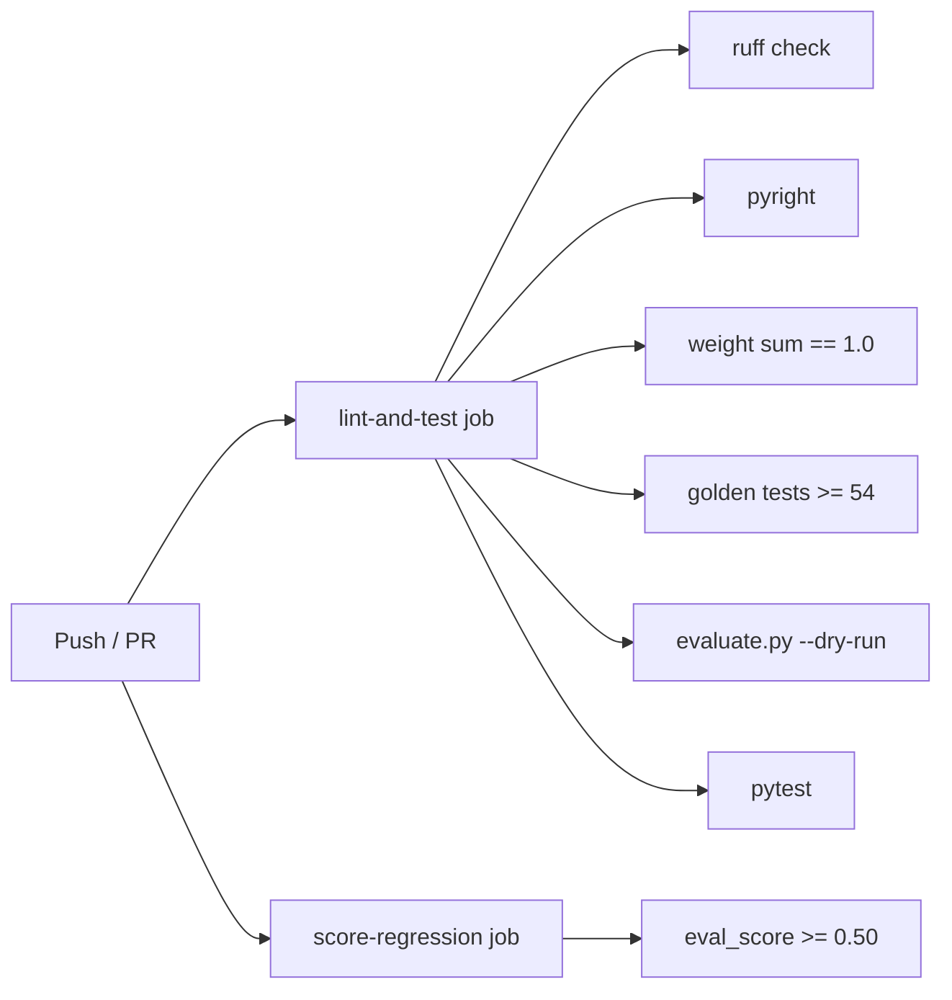

# Development

## Local dev setup

```bash
git clone https://github.com/yash-kavaiya/auto-cxas-scrapi
cd auto-cxas-scrapi
python -m venv .venv && source .venv/bin/activate
pip install -e ".[gemini,dev]"
```

Optional LLM backend extras:

```bash
pip install -e ".[gemini]"      # Gemini
pip install -e ".[openai]"      # OpenAI
pip install -e ".[anthropic]"   # Anthropic
```

---

## Running tests

```bash
# All tests
pytest tests/ -v

# Parallel (faster)
pytest tests/ -n auto

# Single file
pytest tests/test_scorer.py -v

# With coverage
pytest tests/ --cov=src/auto_cxas_scrapi --cov-report=term-missing
```

Tests use `unittest.mock` to patch all CXAS API calls — no live credentials
needed. The `conftest.py` sets `AUTO_CXAS_OAUTH_TOKEN=mock_token`.

---

## Linting and type checking

```bash
# Lint
ruff check .

# Format
ruff format .

# Type check
pyright src/
```

CI runs all three on every push. The ruff config is in `pyproject.toml`
(line-length 100, target Python 3.11).

---

## CI pipeline



Both jobs must pass before a PR merges to `main`.

---

## Adding a new mutation type

1. **Define the type string** — add it to `_ALL_MUTATION_TYPES` in
   `src/auto_cxas_scrapi/planners/llm_planner.py`:

   ```python
   _ALL_MUTATION_TYPES = [
       "prompt_patch",
       "config_update",
       "threshold_tune",
       "template_change",
       "callback_tune",
       "cache_tune",
       "variable_tune",
       "your_new_type",   # ← add here
   ]
   ```

2. **Update the system prompt** — add a description so the LLM knows when
   to use it. Edit the `SYSTEM_PROMPT` string in `llm_planner.py`.

3. **Update `MultiObjectivePlanner`** — map the new type to the eval
   dimensions it affects in `multi_objective_planner.py`:

   ```python
   MUTATION_TYPE_IMPACT = {
       ...
       "your_new_type": ["task_success", "turn_pass_rate"],
   }
   ```

4. **Add a golden test** — add at least one test case to `golden_tests.yaml`
   that exercises the capability your mutation targets. The CI gate checks
   for ≥ 54 tests.

5. **Write a unit test** — add a test to `tests/test_llm_planner.py` that
   verifies the new type appears in proposals when the relevant eval
   dimension is weak.

---

## Adding a new LLM backend

1. Create `src/auto_cxas_scrapi/adapters/llm/your_provider.py` implementing
   the `BaseLLMAdapter` interface:

   ```python
   from auto_cxas_scrapi.adapters.llm.base import BaseLLMAdapter

   class YourProviderAdapter(BaseLLMAdapter):
       def propose(self, system_prompt: str, user_prompt: str) -> str:
           # call your LLM API here
           ...
   ```

2. Register it in `adapters/llm/factory.py`:

   ```python
   from .your_provider import YourProviderAdapter

   _REGISTRY = {
       "gemini": GeminiAdapter,
       "openai": OpenAIAdapter,
       "anthropic": AnthropicAdapter,
       "yourprovider": YourProviderAdapter,
   }
   ```

3. Add an optional dependency group in `pyproject.toml`:

   ```toml
   [project.optional-dependencies]
   yourprovider = ["your-provider-sdk>=1.0"]
   ```

---

## Project conventions

| Convention | Detail |
|---|---|
| Python version | 3.11+ (uses `X \| Y` union syntax, `match` statements) |
| Line length | 100 characters (ruff) |
| Type hints | Required on all public functions and methods |
| Comments | Only for non-obvious WHY; no what/how comments |
| Error handling | Log at WARNING, return empty/default, re-raise after retry exhaustion |
| Git commits | Imperative mood, 72-char subject line, reference issue if applicable |
| Tests | Must not require live CXAS credentials; use `unittest.mock` |
