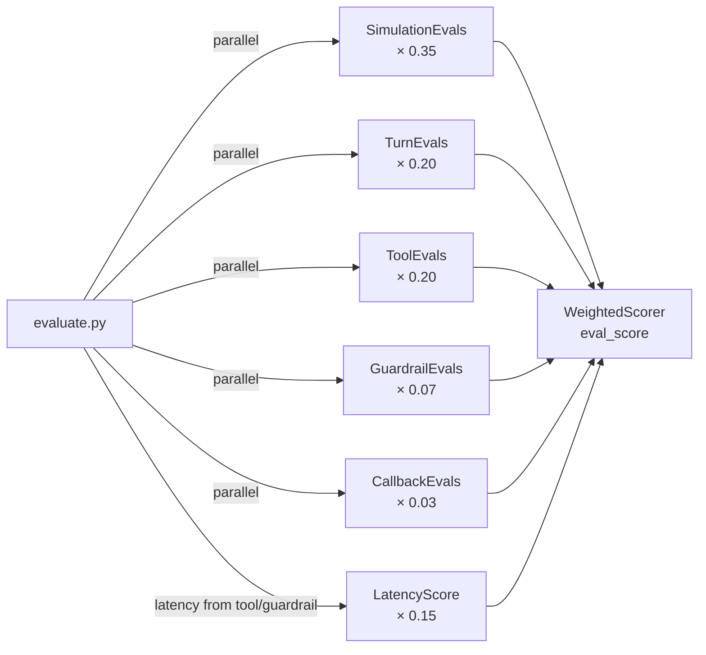

# Eval Types

`auto-cxas-scrapi` evaluates agents across five dimensions, each mapped to a
dedicated eval class from `cxas-scrapi`. All five run concurrently via
`ThreadPoolExecutor` inside `evaluate.py`.



---

## 1. SimulationEvals — `task_success × 0.35`

Runs multi-turn goal-completion simulations. The agent attempts to satisfy
all `goal` conditions in each test case.

**Method:** `SimulationEvals.run_simulations(test_cases, runs, parallel)`

**Return:** `list[dict]` with one entry per run

| Key | Type | Description |
|---|---|---|
| `passed` | `bool` | Whether all goals were met |
| `duration_s` | `float` | Wall-clock time for the simulation |
| `goals` | `str` | Goal conditions tested |
| `expectations` | `str` | Expected agent behaviour |
| `transcript` | `str` | Full conversation transcript |

**pass_rate:** `sum(r["passed"] for r in results) / len(results)`

**Golden test mapping:** gt_001–gt_054 (all 54 tests contribute)

---

## 2. TurnEvals — `turn_pass_rate × 0.20`

Validates per-turn agent responses against expected content, tone, and
format for individual turns within a conversation.

**Method:** `TurnEvals.run_turn_tests(test_cases)`

**Return:** `pd.DataFrame`

| Column | Description |
|---|---|
| `test_name` | Test case identifier |
| `turn` | Turn index within the conversation |
| `user` | User utterance |
| `status` | `SUCCESS` or `FAILURE` |
| `errors` | Validation errors if FAILURE |
| `expected` | Expected response criteria |
| `actual` | Actual agent response |
| `session_id` | CXAS session ID |

**pass_rate:** `(df["status"] == "SUCCESS").mean()`

**Golden test mapping:** gt_001–gt_032 (happy path + multi-turn + ambiguous intents)

---

## 3. ToolEvals — `tool_pass_rate × 0.20` + `latency_score × 0.15`

Verifies that the agent calls the correct tools with the correct parameters,
and measures call latency.

**Method:** `ToolEvals.run_tool_tests(test_cases)`

**Return:** `pd.DataFrame`

| Column | Description |
|---|---|
| `test_name` | Test case identifier |
| `tool` | Tool name |
| `status` | `PASSED`, `FAILED`, or `ERROR` |
| `latency (ms)` | Tool call latency in milliseconds |
| `app_display_name` | CXAS app name |
| `tester` | Eval runner identity |
| `errors` | Error details if FAILED/ERROR |

**pass_rate:** `(df["status"] == "PASSED").mean()`

**latency_score:** `max(0, 1 − p95_latency_ms / 5000)`

**Golden test mapping:** gt_001–gt_016 (happy path), gt_033–gt_039 (edge cases)

---

## 4. GuardrailEvals — `guardrail_pass_rate × 0.07`

Checks that guardrail triggers fire correctly — both ON_DEMAND (explicit
trigger) and ALWAYS_ON (passive monitoring).

**Method:** `GuardrailEvals.run_guardrail_tests(df)`

**Input:** `pd.DataFrame` with columns `user_input`, `expected_guardrail_name`,
`expected_guardrail_type`

**Return:** Extended `pd.DataFrame` with additional columns:

| Column | Description |
|---|---|
| `pass` | `True` if guardrail behaviour matched expectation |
| `latency (ms)` | Session latency |
| `actual_triggered` | Whether a guardrail fired |
| `actual_guardrail_name` | Name of the guardrail that fired (or `None`) |
| `error_details` | Error string if the eval itself failed |

**pass_rate:** `df["pass"].mean()`

**Golden test mapping:** gt_040–gt_044 (guardrail triggers)

---

## 5. CallbackEvals — `callback_pass_rate × 0.03`

Runs pytest-based unit tests against agent lifecycle callbacks
(`before_model`, `after_model`, `before_tool`, `after_tool`, `after_agent`).

**Method:** `CallbackEvals.test_all_callbacks_in_app_dir(app_dir)`

**Return:** `pd.DataFrame`

| Column | Description |
|---|---|
| `agent_name` | Agent the callback belongs to |
| `callback_type` | e.g. `before_model_callback` |
| `test_name` | pytest test function name |
| `status` | `PASSED`, `FAILED`, or `SKIPPED` |
| `error_message` | Failure message if applicable |

**pass_rate:** `(df["status"] == "PASSED").mean()`

**Directory layout expected:**
```
agents/<agent_name>/<callback_type>/<callback_name>/
  ├── python_code.py    # callback implementation
  └── test.py           # pytest test file
```

---

## Dry-run mode

When `--dry-run` is passed, `evaluate.py` bypasses all live CXAS API calls
and uses a heuristic scorer. Dry-run scores are not suitable for production
but allow full loop testing without credentials.

```bash
python auto_loop.py --dry-run --max-experiments 10
```

---

## results.tsv schema

Every experiment appends one row to `results.tsv`:

| Column | Description |
|---|---|
| `ts` | ISO-8601 timestamp |
| `experiment` | Sequential experiment number |
| `eval_score` | Composite weighted score (0–1) |
| `task_success` | SimulationEvals pass rate |
| `turn_pass_rate` | TurnEvals pass rate |
| `tool_pass_rate` | ToolEvals pass rate |
| `latency_score` | Latency component (0–1) |
| `guardrail_pass_rate` | GuardrailEvals pass rate |
| `callback_pass_rate` | CallbackEvals pass rate |
| `action` | `keep`, `discard`, or `baseline` |
| `mutation_type` | Mutation type applied |
| `tag` | Run label (from `--tag`) |
