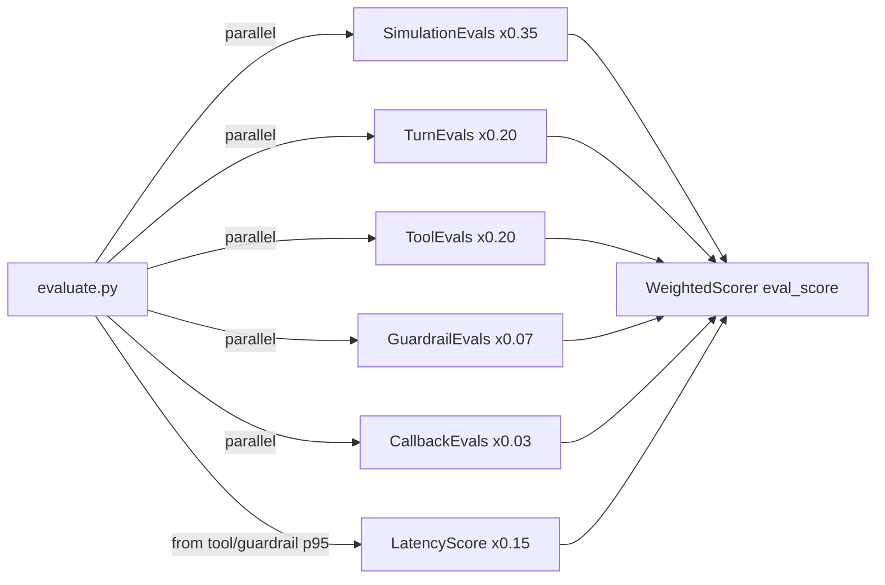

# Eval Types

All five eval types run concurrently via `ThreadPoolExecutor` inside `evaluate.py`.



---

## 1. SimulationEvals — task_success x 0.35

Runs multi-turn goal-completion simulations.

**Method:** `SimulationEvals.run_simulations(test_cases, runs, parallel)`

**Returns:** `list[dict]`

| Key | Type | Description |
|---|---|---|
| `passed` | `bool` | Whether all goals were met |
| `duration_s` | `float` | Wall-clock simulation time |
| `goals` | `str` | Goal conditions tested |
| `transcript` | `str` | Full conversation transcript |

**pass_rate:** `sum(r["passed"] for r in results) / len(results)`

---

## 2. TurnEvals — turn_pass_rate x 0.20

Validates per-turn agent responses.

**Method:** `TurnEvals.run_turn_tests(test_cases)`

**Returns:** `pd.DataFrame`

| Column | Description |
|---|---|
| `test_name` | Test identifier |
| `turn` | Turn index |
| `status` | `SUCCESS` or `FAILURE` |
| `errors` | Validation errors |
| `expected` / `actual` | Expected vs actual response |
| `session_id` | CXAS session ID |

**pass_rate:** `(df["status"] == "SUCCESS").mean()`

---

## 3. ToolEvals — tool_pass_rate x 0.20 + latency x 0.15

Verifies correct tool calls and measures latency.

**Method:** `ToolEvals.run_tool_tests(test_cases)`

**Returns:** `pd.DataFrame`

| Column | Description |
|---|---|
| `tool` | Tool name |
| `status` | `PASSED`, `FAILED`, or `ERROR` |
| `latency (ms)` | Tool call latency |
| `errors` | Error details |

**pass_rate:** `(df["status"] == "PASSED").mean()`  
**latency_score:** `max(0, 1 - p95_latency_ms / 5000)`

---

## 4. GuardrailEvals — guardrail_pass_rate x 0.07

Checks guardrail triggers for ON_DEMAND and ALWAYS_ON types.

**Method:** `GuardrailEvals.run_guardrail_tests(df)`

**Returns:** Extended `pd.DataFrame`

| Column | Description |
|---|---|
| `pass` | `True` if guardrail matched expectation |
| `latency (ms)` | Session latency |
| `actual_guardrail_name` | Name of guardrail that fired (or `None`) |
| `error_details` | Error string if eval failed |

**pass_rate:** `df["pass"].mean()`

---

## 5. CallbackEvals — callback_pass_rate x 0.03

Runs pytest tests against agent lifecycle callbacks.

**Method:** `CallbackEvals.test_all_callbacks_in_app_dir(app_dir)`

**Returns:** `pd.DataFrame`

| Column | Description |
|---|---|
| `agent_name` | Agent the callback belongs to |
| `callback_type` | e.g. `before_model_callback` |
| `test_name` | pytest test function name |
| `status` | `PASSED`, `FAILED`, or `SKIPPED` |
| `error_message` | Failure message if applicable |

**pass_rate:** `(df["status"] == "PASSED").mean()`

---

## Dry-run mode

```bash
python auto_loop.py --dry-run --max-experiments 10
```

Bypasses all live CXAS API calls and uses a heuristic scorer.
Useful for testing the loop logic without credentials.

---

## results.tsv schema

| Column | Description |
|---|---|
| `ts` | ISO-8601 timestamp |
| `experiment` | Sequential experiment number |
| `eval_score` | Composite weighted score (0-1) |
| `task_success` | SimulationEvals pass rate |
| `turn_pass_rate` | TurnEvals pass rate |
| `tool_pass_rate` | ToolEvals pass rate |
| `latency_score` | Latency component (0-1) |
| `guardrail_pass_rate` | GuardrailEvals pass rate |
| `callback_pass_rate` | CallbackEvals pass rate |
| `action` | `keep`, `discard`, or `baseline` |
| `mutation_type` | Mutation type applied |
| `tag` | Run label (from `--tag`) |
